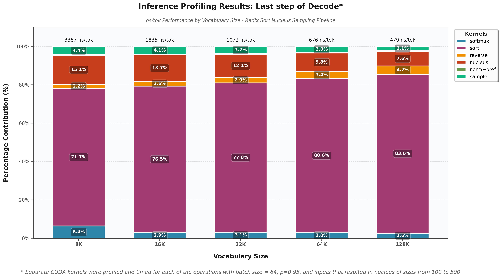

# 🚀 Top-P Sampling CUDA Implementation

**CUDA kernels for nucleus (top-p) sampling in Large Language Models**

## 📊 Performance Profiling Results

### Inference Profiling: Last Step of Decode

The comprehensive CUDA kernel profiling reveals critical performance insights for top-p sampling:



**Key Findings:**
- 🔴 **Radix Sort Bottleneck**: Dominates 71-83% of total execution time across vocabulary sizes
- 📈 **Scaling Impact**: Becomes increasingly problematic with larger vocabularies (up to 83% at 131K)
- 🎯 **Optimization Target**: Radix sort presents the primary opportunity for performance improvement
- 📊 **Secondary Operations**: Nucleus filtering (7-15%) and softmax (2-6%) are minor contributors

*Analysis conducted with batch size = 64, p = 0.95, nucleus sizes 100-500 tokens*

## 🏗️ Build and Run

### Prerequisites
- NVIDIA GPU with CUDA 12.0+
- CUDA Toolkit installed
- Make sure `nvcc` is in your PATH

### Compilation
```bash
nvcc -Iinclude -Iprof tests/test_batch_normal.cu top_p.cu \
     src/softmax.cu src/sort.cu src/reverse.cu src/nucleus.cu src/sample.cu \
     -o test_batch_normal
```

### Running Tests
```bash
# Basic test with default parameters
./test_batch_normal

# Custom parameters
./test_batch_normal --batches 64 --vocab_size 4096 --variance 12.0 --seed 78
```

## 📁 Project Structure

```
├── include/           # Header files
│   ├── nucleus.h     # Nucleus sampling declarations
│   ├── sample.h      # Token sampling declarations
│   ├── softmax.h     # Softmax computation
│   ├── sort.h        # Radix sort implementation
│   └── reverse.h     # Array reversal utilities
├── src/              # CUDA kernel implementations
│   ├── nucleus.cu    # Nucleus filtering kernel
│   ├── sample.cu     # Token sampling kernel
│   ├── softmax.cu    # Softmax computation kernel
│   ├── sort.cu       # Radix sort kernel
│   └── reverse.cu    # Array reversal kernel
├── tests/            # Test suites
│   └── test_batch_normal.cu  # Main test file
├── prof/             # Profiling tools and results
│   ├── prof_results/ # Profiling output and visualizations
│   ├── generate_prof_data/  # Profiling data generation
│   └── cuda_timer.h  # CUDA timing utilities
└── top_p.cu          # Main top-p sampling implementation
```

## 🔬 Profiling Methodology

### Current Status
- ✅ **Top-P Pipeline Profiling**: Complete analysis of all sampling kernels
- 🚧 **Isolated Radix Sort Profiling**: In progress using NVIDIA Nsight Compute (NCU)
- 🎯 **Optimization Focus**: Radix sort kernel optimization for improved inference latency

### Profiling Tools Used
- **NVIDIA Nsight Systems**: System-level performance analysis
- **NVIDIA Nsight Compute**: Kernel-level optimization insights
- **Custom CUDA Timers**: Precise kernel timing measurements

## 🎯 Performance Insights

| Vocabulary Size | Total ns/tok | Sort % | Nucleus % | Softmax % |
|----------------|--------------|--------|-----------|-----------|
| 8,192         | 3,386.62     | 71.73% | 15.08%    | 6.36%     |
| 16,384        | 1,835.31     | 76.48% | 13.68%    | 2.86%     |
| 32,768        | 1,071.61     | 77.81% | 12.10%    | 3.14%     |
| 65,536        | 675.76       | 80.56% | 9.77%     | 2.82%     |
| 131,072       | 479.11       | 82.96% | 7.62%     | 2.63%     |

## 🚀 Future Work

- [ ] Complete isolated radix sort profiling with NCU
- [ ] Implement radix sort optimizations (shared memory, warp-level primitives)
- [ ] Benchmark against cuDNN/cuBLAS alternatives
- [ ] Add support for larger batch sizes and dynamic vocabulary sizes
- [ ] Integrate with popular LLM inference frameworks

## 🤝 Contributing

Contributions are welcome! Areas of particular interest:
- Radix sort optimizations
- Memory access pattern improvements
- Warp-level parallelism enhancements
- Integration with existing LLM inference pipelines

## 📄 License

This project is licensed under the MIT License - see the [LICENSE](LICENSE) file for details.

## 📞 Contact

For questions or collaboration opportunities, feel free to reach out!

---