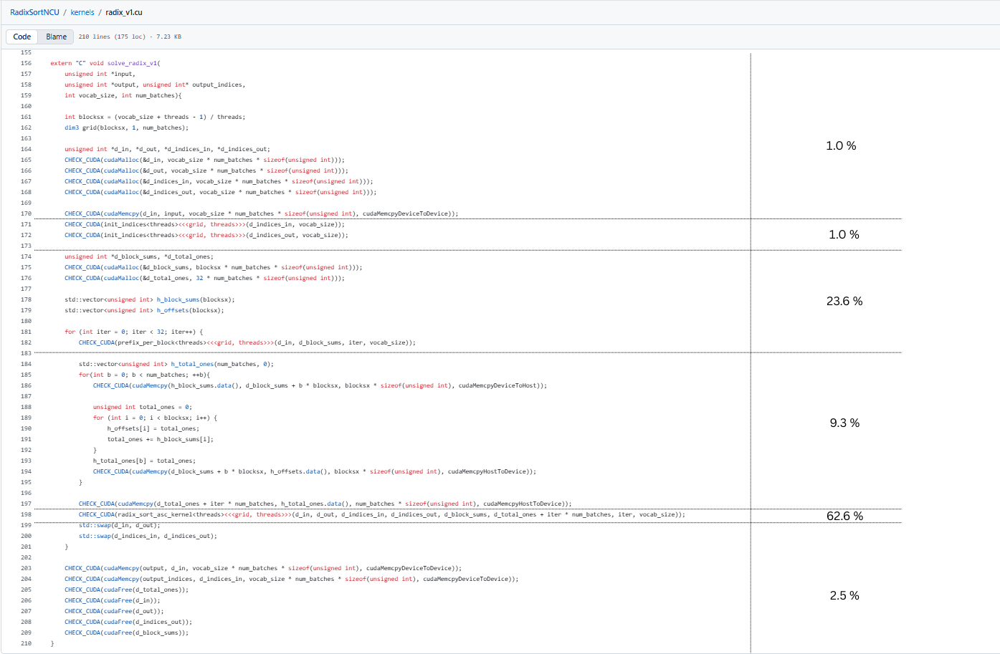
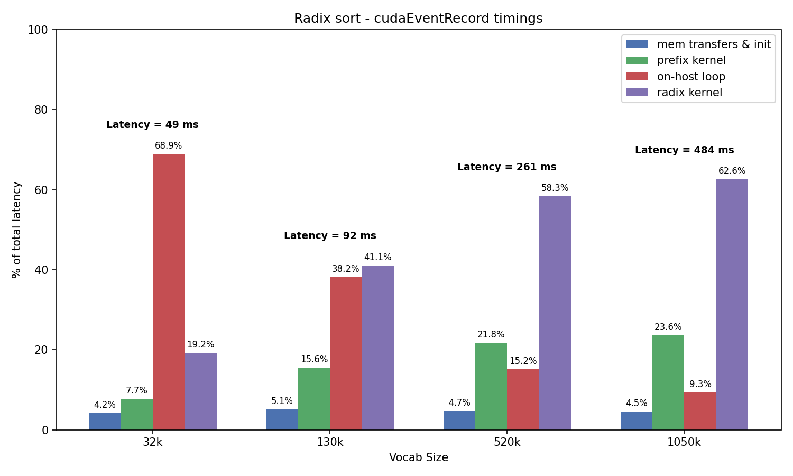

## Run 1: Radix Sort Launcher Analysis

We profile the complete radix sort launcher with 256 batches using both Nvprof and cudaEvent instrumentation to understand the contribution of each component.

### Context

The GPU trace outputs in `prof/txt` reveal that small transfers within the per-bit loop in the radix kernel are approximately 3-3.5x faster for HtoD compared to DtoH.

### Nvprof Summary

Table below shows `Time(%) / Time` for the main GPU activities extracted from the nvprof outputs in `prof/txt/` for `--num_batches=256` and four `--vocab_size` values.

| **Activity** | **vocab=32,768** | **vocab=131,072** | **vocab=524,288** | **vocab=1,048,576** |
|---|---:|---:|---:|---:|
| `radix_sort_asc_kernel` | 35.0%  10 ms | 42.1%  38 ms | 44.3%  154 ms | 44.2%  308 ms |
| `[cudaMemcpy HtoD]` | 32.1%  9 ms | 32.8%  30 ms | 33.2%  115 ms | 33.8%  235 ms |
| `[cudaMemcpy DtoH]` | 15.8%  4 ms | 4.9%  4 ms | 1.3%  5 ms | 0.7%  5 ms |
| `prefix_per_block` | 15.2%  4 ms | 17.8%  16 ms | 18.5%  64 ms | 18.8%  131 ms |
| `[cudaMemcpy DtoD]` | 1.5%  0 ms | 1.9%  2 ms | 1.9%  7 ms | 1.9%  14 ms |
| `init_indices` | 0.5%  0 ms | 0.6%  1 ms | 0.7%  2 ms | 0.7%  5 ms |
| **Latency (ms)** | **27 ms** | **91 ms** | **347 ms** | **697 ms** |
| **ns / token** | **1673 ns** | **1391 ns** | **1325 ns** | **1328 ns** |

### cudaEvent Timings Summary

Given the surprisingly high HtoD overhead in Nvprof, we investigated further with isolated cudaEvent timings for all execution stages:

| **Op (%) \ vocab_size** | **32,768** | **131,072** | **524,288** | **1,048,576** |
|---|---:|---:|---:|---:|
| DtoD for buffer | 0.3%  0 ms | 0.6%  1 ms | 0.9%  2 ms | 1.0%  5 ms |
| init_indices | 0.5%  0 ms | 0.7%  1 ms | 0.9%  2 ms | 1.0%  5 ms |
| In per-bit loop: prefix_per_block | 7.7%  4 ms | 15.6%  14 ms | 21.8%  57 ms | 23.6%  114 ms |
| In per-bit loop: loop over batches* | 68.9%  34 ms | 38.2%  35 ms | 15.2%  40 ms | 9.3%  45 ms |
| In per-bit loop: HtoD for total_ones | 0.2%  0 ms | 0.1%  0 ms | 0.0%  0 ms | 0.0%  0 ms |
| In per-bit loop: radix | 19.2%  9 ms | 41.1%  38 ms | 58.3%  152 ms | 62.6%  303 ms |
| DtoD for output and cudaFrees | 3.2%  2 ms | 3.7%  3 ms | 2.9%  8 ms | 2.5%  12 ms |
| **Latency (ms)** | **49 ms** | **92 ms** | **261 ms** | **484 ms** |
| **ns / token** | **1495 ns** | **701 ns** | **498 ns** | **462 ns** |

*includes: DtoH + loop over batches + HtoD*

#### Analysis & Key Insights

**Nvprof vs. cudaEventRecord Overhead**

The overhead from Nvprof (vs cudaEventRecord) is substantial, accounting for a ~44% increase in total latency. This discrepancy occurs because Nvprof profiles GPU activities across the entire driver (in `drivers/main.cu`) and includes implicit memory operations, whereas cudaEventRecord measures only the launcher itself. Detailed GPU traces in `/prof/txt/run1/nvprof_gputrace_radix_v1_256_1048576.txt` reveal two large HtoD transfers of ~230 ms each (~460 ms total) occurring before the DtoD buffer copy—these driver-level operations are captured by Nvprof but not by our cudaEvent instrumentation.

**Bottleneck Components**

The cudaEventRecord timings confirm three critical findings:

1. **CPU-side loop overhead**: The on-host nested loop (bits→batches→blocks) dominates small-to-medium vocabularies (69% at 32K) but diminishes to 9% at 1M tokens as GPU kernel costs rise.

2. **GPU kernel scaling**: The radix and prefix_per_block kernels together grow from 27% at 32K tokens to **86% at 1M tokens**, becoming the dominant bottleneck at larger scales.

3. **Remaining overhead**: Memory transfers and index initialization account for 4.0–4.5% across all vocabulary sizes and are not optimization targets.

**Code-Level Attribution**

The distribution of latency across code regions for the largest vocabulary (1M tokens):

#### Timing breakdown (cudaEventRecord)

The chart below shows the percent contribution of each pipeline component (mem/init, prefix kernel, on-host loop, radix kernel) for four vocabulary sizes. Group annotations show the measured total latency per configuration.

#### Why Radix Sort?

Radix sort significantly outperforms Bitonic sort across all vocabulary sizes, justifying our focus on radix optimization.

| **Vocab Size** | **Radix** | **Bitonic** | **Advantage (Bitonic / Radix)** |
|---|---:|---:|---:|
| 32,768 | **49 ms** | **77.5 ms** | **1.6x** |
| 131,072 | **92 ms** | **356.3 ms** | **3.9x** |
| 524,288 | **261 ms** | **1642 ms** | **6.3x** |
| 1,048,576 | **484 ms** | **3500 ms** | **7.25x** |