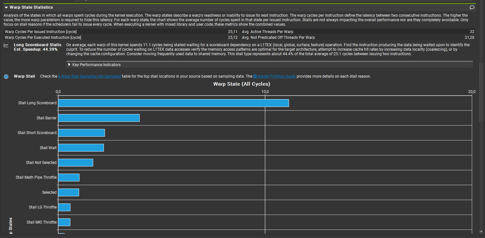
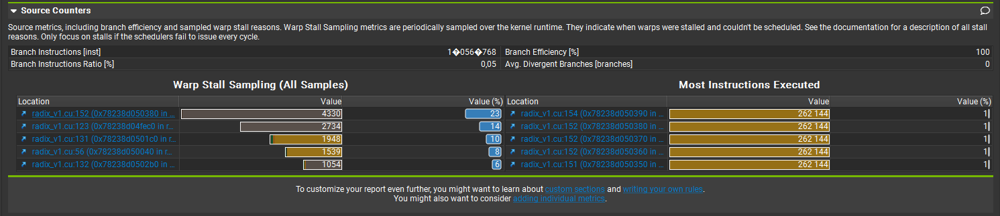
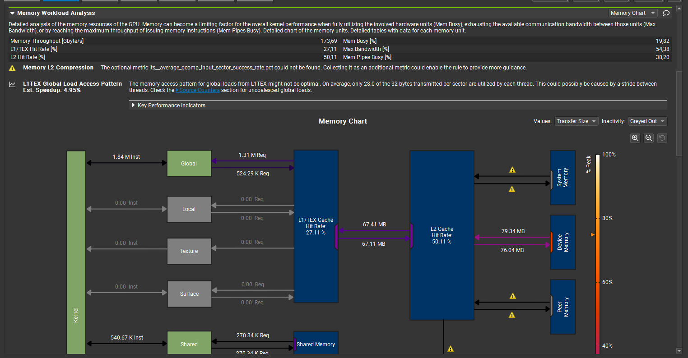
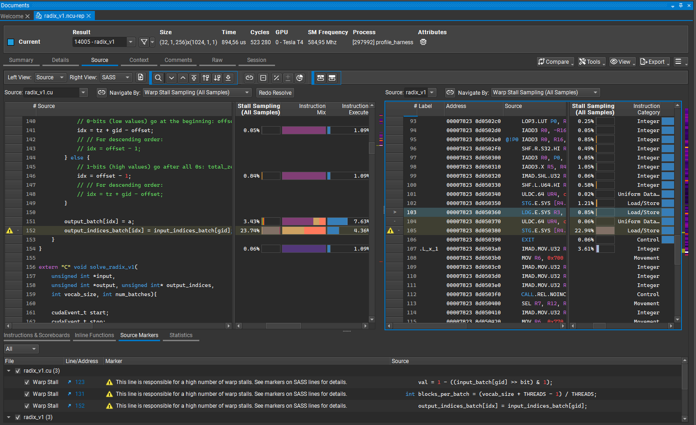
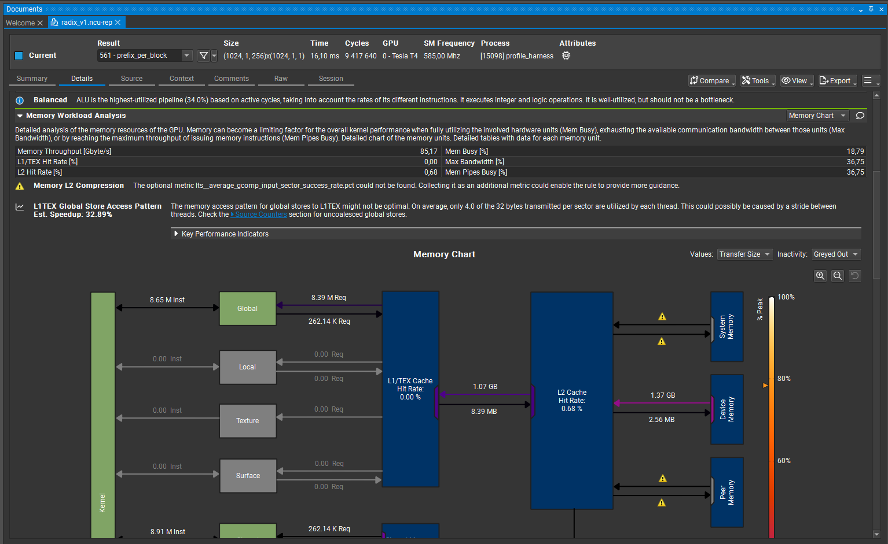
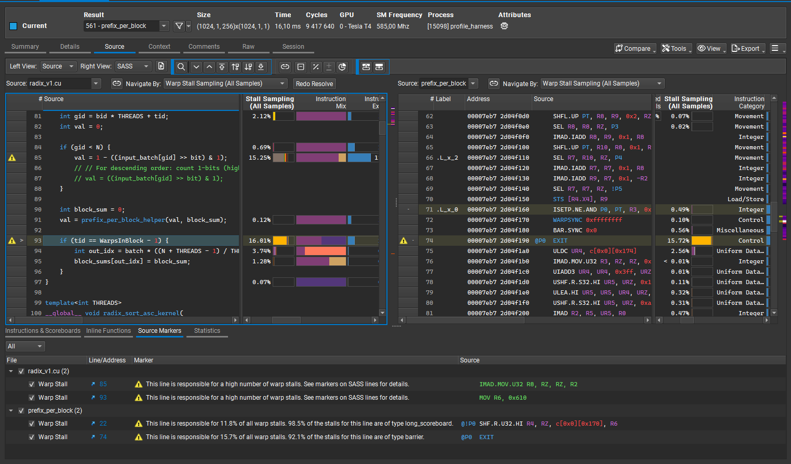
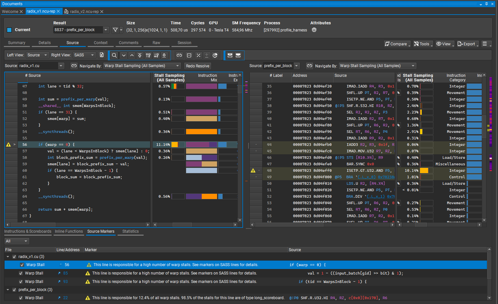
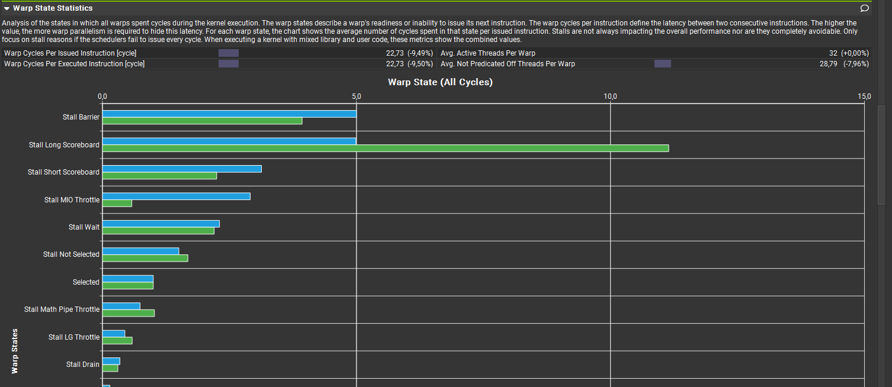
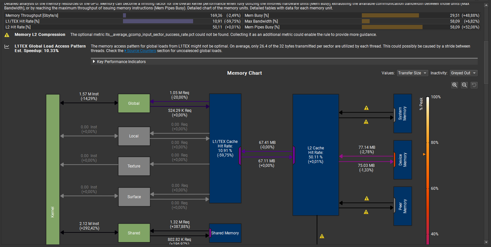

## Run 2: Individual Kernel Profiling

We profile the two primary kernels in isolation: `prefix_per_block` and `radix_sort_asc_kernel`.

### I.1. `radix_v1`

**The major bottlenecks for this kernel were:**

- **Long Scoreboard Stalls** — *Est. Speedup: 44.13%*
	- On average, each warp spends **11.1 cycles** stalled waiting for a scoreboard dependency on an L1TEX operation. This stall type represents about **44.1%** of the average 25.1 cycles between issuing two instructions.
	- Guidance: identify the producing instruction, improve memory access patterns (coalescing), increase data locality or change cache config, and consider moving frequently used data to shared memory.
	- Metrics:
		- `smsp__issue_active.avg.per_cycle_active = 0.301733` — increase issued instructions per cycle
		- `smsp_average_long_scoreboard = 11.0839` — reduce long scoreboard cycles

- **Uncoalesced Global Accesses** — *Est. Speedup: 13.48%*
	- Kernel shows uncoalesced global reads/writes resulting in **917,186 excessive sectors** (≈14% of 6,684,354 sectors).
	- Guidance: check the L2 theoretical sectors table and refactor memory layout / access stride.

- **L1TEX Global Store Access Pattern** — *Est. Speedup: 13.41%*
	- Global store pattern uses **≈22.3 of 32 bytes per sector** on average; suggests a stride/aliasing issue.

**Visual evidence**



Long Scoreboard & Barrier stalls account for the majority of stalls:



Memory workload (SRAM usage vs L1/L2 hit rates):



The single source line producing the largest stalls is shown below (global-to-global load/store):



### I.2. `prefix_per_block`

**Primary bottleneck reported by NCU:**

- **L1TEX Global Store Access Pattern** — *Est. Speedup: 32.89%*
	- On average only **4.0 of 32 bytes per sector** are utilized by each thread (very sparse writes).
	- Metric: `smsp__sass_average_data_bytes_per_sector_mem_global_op_st.ratio = 4`
	- Guidance: increase bytes utilized per sector (coalesce, restructure writes).

Memory workload indicates near-zero L1/L2 hit rates for this kernel, so L1 throughput is not meaningful here:



Source counters flagged the following source locations as uncoalesced contributors:





These are algorithmic: the tree reduction produces a single output per block (one thread writes `block_sums`), creating a sparse scatter pattern and the low 4/32 utilization.

The line responsible for major stalls in both `radix_v1` and this kernel is:

```c
val = 1 - ((input_batch[gid] >> bit) & 1);
```

**Corollary:** use of Shared Memory was proposed to reduce the observed stalls and improve locality.

---

## II. `radix_v2.cu`

**TL;DR:** duration of `radix` remained unchanged; duration of `prefix` increased by **~20%** (deterioration). Moving inputs to SRAM did not help overall.

### II.1. `radix_v2`

- Remaining significant bottleneck: **L1TEX Global Store Access Pattern** (est. speedup ≈ **+10%**, improved from +33%).

- The previous dominant `Stall Long Scoreboard` was reduced by more than half, however other stall categories increased (Stall Barrier, Stall Short Scoreboard, Stall MIO Throttle). Overall Warp Cycles per Issued Instruction decreased by ~10%.



Memory workload shows heavier SRAM usage, at the expense of L1 (L1 hit rate down **27% → 11%**):



### II.2. `prefix`

The kernel performance deteriorated; investigation notes:

- **L1TEX Global Store Access Pattern** remains the top issue (est. speedup now **+37%**, up from +32%).
- This bottleneck is algorithmic (sparse per-block writes) and requires redesign to eliminate.

Effects observed after moving `input_batch` to SRAM:

- Branch instructions increased **+65%** (to ~1.33M).
- All active cycle counts (Total Elapsed & Average Active) increased **~20%**, except **Average L2** and **Average DRAM** active cycles which remained unchanged.

The remaining hotspot now attributes most cost to the SRAM load line:

```c
s_input_batch[tid] = __ldg(input_batch + gid);
```

**Corollary:** try a different approach (redesign algorithm, reduce uncoalesced writes, or compute offsets entirely on GPU).
