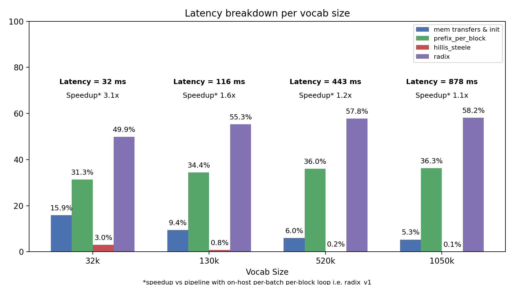

## Run 3: Hillis–Steele GPU exclusive-sum replacement (radix_v3)

Summary
- Replaced the on-host per-batch prefix loop with a GPU Hillis–Steele exclusive-sum kernel (`hillis_steele_prefix_excl`).
- Results below show full launcher latency, the latency of the inner 32-bit iteration loop, and per-kernel timing proportions inside the iter-loop.
- Outcome: the introduced Hillis–Steele kernel adds negligible cost (~1 ms) while removing host/device syncs; most time remains in `prefix_per_block` and `radix` kernels.
- Unsuprisingly the largest benefit is observed for the smallest vocab size where the on-host loop was the largest bottleneck (see [Run 1](https://github.com/MattJBorowski1991/RadixSortNCU/blob/master/prof/results/run1.md)).

### I. Full launcher latency (ms)
| Vocab Size | Before (radix_v1) | After (radix_v3) | Speedup |
|---:|---:|---:|---:|
| 32,768  | 99.1  | 32.10   | 3.09x |
| 131,072 | 185.56  | 115.55  | 1.61x |
| 524,288 | 522.90 | 443.41 | 1.18x |
| 1,048,576 | 969.5 | 877.54 | 1.11x |

### II. Latency breakdown (ms)

We again set the batch size to `64` and profile the radix pipeline across several vocab sizes.

<table>
	<thead>
		<tr>
			<th rowspan="2">Vocab Size</th>
			<th colspan="4">Latency (ms)</th>
			<th rowspan="2">mem transfers &amp; init</th>
		</tr>
		<tr>
			<th>Total</th>
			<th>prefix_per_block</th>
			<th>hillis_steele</th>
			<th>radix</th>
		</tr>
	</thead>
	<tbody>
		<tr><td>32,768</td><td>32.10</td><td>10.04 (31.3%)</td><td>0.96 (3.0%)</td><td>16.00 (49.9%)</td><td>5.10 (15.9%)</td></tr>
		<tr><td>131,072</td><td>115.55</td><td>39.78 (34.4%)</td><td>0.96 (0.8%)</td><td>63.92 (55.3%)</td><td>10.89 (9.4%)</td></tr>
		<tr><td>524,288</td><td>443.41</td><td>159.50 (36.0%)</td><td>1.01 (0.2%)</td><td>256.23 (57.8%)</td><td>26.68 (6.0%)</td></tr>
		<tr><td>1,048,576</td><td>877.54</td><td>318.82 (36.3%)</td><td>1.07 (0.1%)</td><td>511.07 (58.2%)</td><td>46.58 (5.3%)</td></tr>
	</tbody>
</table>

The numbers from the table are presented on the chart below. The replacement of the on-host loop provided a performance improvement in particular for small vocab sizes. `prefix_per_block` and `radix` remain largest bottlenecks - the larger the vocab size the larger their is their impact.

**Notes**

- **Hillis–Steele cost.** The GPU Hillis–Steele exclusive-sum kernel is very small in absolute time (~1 ms measured here) and does not increase significantly with vocabulary size; it is not on the critical path for large inputs.

- **Dominant work.** The `prefix_per_block` and `radix` kernels account for the vast majority of the iter-loop latency and scale faster than linearly with input size. Further performance work should prioritise those kernels.

- **Cooperative launch limitation.** A single cooperative kernel launch requires all resident blocks used by the launch to fit within the device's cooperative capacity (SMs × maxBlocksPerSM). On a T4 (40 SMs × 16 blocks/SM = 640 blocks) a full-grid launch for `vocab_size=1,048,576` with `num_batches=256` would need 65,536 blocks, which exceeds the device limit; hence the cooperative approach is not feasible for this workload. See `kernels/radix_v3_coop.cu` for the attempted implementation and failure notes.

### III. Overhead

The `mem transfers & init` part becomes a significantly larger part of the pipeline — ca. 16% for the 32k vocab. These small vocab sizes are where the vast majority of applications are today (February 2026). Based on Run 1 results, the impact of `mem transfers & init` is evenly split before and after the iter-loop and is comprised of mandatory memory allocations, memory copies to the buffer, initializing index pointers, and freeing memory — all necessary for Radix Sort.

We conclude that the only possible future optimizations can be applied inside the iter-loop (i.e. where the three kernels are called). The iter-loop (loop over the bits) is an inherent part of Radix Sort and cannot be fully removed.

### IV. Summary and Next steps

The remaining possible optimizations are:
1. Moving from binary Radix to multi-bit Radix
2. Optimizing `prefix` and `radix` deeper with Nsight Compute
3. Implement a Cuda graph
